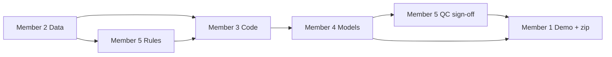

# Bravo Team — Detailed Work Distribution  
## Member 1–5 role slots, dependencies, and parallel paper + code tracks

> **Weekly schedule, Gantt, member×week table, and PM rituals:** see **[PROJECT_MASTER_PLAN.md](./PROJECT_MASTER_PLAN.md)**.

Use **Member 1** through **Member 5** as **five fixed role bundles**. Each real person **claims one Member number** for the whole project (or rotate only if the team explicitly agrees). This doc defines **what each slot does**, **who they depend on**, and **who depends on them**.

---

## 0. Choosing roles

| Member slot | Role title (maps to course sheet) | One-line summary |
|-------------|-------------------------------------|------------------|
| **Member 1** | PM + **inference demo** + paper front/back | Meetings/milestones; **`04_inference_demo`** notebook/script; Abstract, Intro, Conclusion, Ack; final PDF/zip (**equal code load**) |
| **Member 2** | Analyst + literature & references | Dataset choice, EDA, data dictionary, Related Work, `.bib`, Materials (data); **co-scribes meeting notes** |
| **Member 3** | Programmer (prep only) | Preprocess + transforms + encoding/scaling; `requirements.txt`; README draft; **Materials (preprocess)** — **not** feature engineering |
| **Member 4** | ML/DL + experiments | **Feature engineering** + models, CV, metrics, figures; **Materials (models/training)** + Experiments & Results |
| **Member 5** | Quality control + evaluation rigor | `05_qc_checks` notebook, train/val/test rules, leakage, Windows README + **README sign-off with M3**, Discussion |

**Team roster (fill in):**

| Member slot | Name |
|-------------|------|
| Member 1 | __________________ |
| Member 2 | __________________ |
| Member 3 | __________________ |
| Member 4 | __________________ |
| Member 5 | __________________ |

---

## 1. Dependency overview (whose work depends on whom)

### 1.1 Engineering / code dependencies

| Member | Depends on (must have from them before you can finish) | Who depends on this member |
|--------|--------------------------------------------------------|----------------------------|
| **Member 1** | **Member 4**: saved model + feature schema for inference demo; everyone for paper pieces; **Member 5** for README sign-off | **Blocks** final zip/submission; starts inference work **after** first trained model export |
| **Member 2** | Nothing to start EDA; team agreement on **target variable** definition | **Member 3** (needs schema, data path, missingness rules); **Member 5** (needs data facts for leakage analysis); **paper** Related Work + dataset description |
| **Member 3** | **Member 2**: locked dataset + dictionary; **Member 5**: **split / leakage rules** (documented) before encoding train-only stats | **Member 4** (needs clean transformed tabular input for **feature engineering**); **Member 5** (tests pipeline) |
| **Member 4** | **Member 3**: preprocess/transforms output; **Member 5**: approved eval protocol (metrics, CV folds) | **Member 5** (QC); **Member 1** (**saved model** + predictions table for demo & Conclusion) |
| **Member 5** | **Member 2**: data overview early; can define **protocol in Week 1** in parallel | **Member 3** (cannot finalize preprocessing without split rules); **Member 4** (cannot finalize experiments without acceptance criteria) |

**Critical path (typical order):**  
**Member 2** (data lock) → **Member 5** (split/leakage rules) + **Member 3** (preprocess/features) → **Member 4** (train/eval) → **Member 5** (sign-off) → **Member 1** (paper + zip).

### 1.2 Paper dependencies (Overleaf)

| Paper section | Lead | Cannot be finalized until… |
|---------------|------|----------------------------|
| Abstract | Member 1 | Introduction draft has stable problem + contribution wording |
| Introduction / problem | Member 1 | Member 2 + Member 5 agree on **problem framing** (what is predicted, from what data) |
| Related Work | Member 2 | Enough papers collected (can draft early with placeholders) |
| Materials (dataset) | Member 2 | Member 2 data card done |
| Materials (preprocess / transforms) | Member 3 | Matches `02_preprocess` code |
| Materials (models / training) | Member 4 | Matches `03_train_eval` code |
| Experiments & Results | Member 4 | Numbers + figures from Member 4 |
| Discussion | Member 5 | Member 4 results + Member 5 limitation notes |
| Conclusion | Member 1 | Discussion stable |
| References | Member 2 | `.bib` complete |
| Final compile | Member 1 | All sections reviewed |

**Parallel rule:** Member 2 and Member 5 can write **early drafts** in Week 1; Member 3 must **sync prose to code** before final print; Member 4 replaces **TBD** metrics by end of Week 3.

### 1.3 Visual dependency diagram



*Interpretation:* Member 5 appears twice conceptually—**rules early** (enables Member 3) and **QC late** (after Member 4). Member 1 runs **throughout** but **finalizes** last.

---

## 2. Platforms & tools (single agreed stack)

| Layer | Choice | Typical owner | Notes |
|-------|--------|---------------|--------|
| **GitHub** (private) | Everyone | Member 1 (milestones) | PRs; Issues |
| **Chat** | Team picks one | Everyone | Daily async |
| **Meetings** | Zoom / Meet | Member 1 runs agenda | Weekly + optional midweek |
| **Python** | `venv` + `requirements.txt` | **Member 3** owns file | All install same versions |
| **Notebooks** | Jupyter / Colab | Member 3, Member 4 | Export `.ipynb` to repo |
| **Overleaf** | SCITEPRESS template | **Member 1** admin | One shared project |
| **References** | `.bib` on Overleaf | **Member 2** | |
| **Large data** | Git LFS or download script | Member 2 + Member 3 | Avoid huge blobs on `main` without LFS |

---

## 3. Where we get datasets

**Primary:** Kaggle (or similar) job posting + salary signal; **optional:** BLS/O*NET enrichment. **Member 2** owns final choice, license, citation; **Member 5** reviews for **leakage** (e.g., target-derived columns in features).

---

## 3b. Two parallel tracks (code + paper every week)

| Week | Track A — Engineering | Track B — Paper (Overleaf) |
|------|------------------------|----------------------------|
| **1** | Repo skeleton, load data, EDA, baseline | Intro draft; Related Work outline; problem statement agreed |
| **2** | Preprocess, transforms, feature pipeline v1 | Materials + Related Work full draft |
| **3** | Models, CV, figures | Experiments & Results (fill numbers as they land) |
| **4** | Error analysis, README, code freeze | Discussion, Conclusion polish |
| **5** | Zip dry-run, Windows test | SCITEPRESS format, 6–8 pages, proofread |

**Syncs:** mid-week **Member 1 + Member 3 + Member 4** (claims match code); end-of-week full team demo + paper review.

---

## 4. Work by Member slot (tasks + handoffs)

### Member 1 — Project Manager + inference demo + paper integrator

| Area | Tasks |
|------|--------|
| **Code** | `notebooks/04_inference_demo.ipynb` (or `scripts/predict.py`): load **Member 4’s saved model**, run on sample/holdout rows, table of predictions for paper/demo; **full dry-run** from clean clone before Canvas zip |
| **Process** | Agendas, GitHub milestones, risk log, `/docs/meetings/` — **Member 2 co-scribes** notes so admin is shared |
| **Paper** | Overleaf permissions; **Abstract**, **Introduction**, **Conclusion**, **Acknowledgments**; final SCITEPRESS compile; page limit |
| **Depends on** | Member 4 (model artifact + input schema); Member 5 (README OK); everyone (section drafts) |
| **Blocks** | Final submission until QC and paper complete |

### Member 2 — Analyst + literature

| Area | Tasks |
|------|--------|
| **Data** | Dataset selection; license; `notebooks/01_eda.ipynb`; data dictionary |
| **Paper** | **Related Work** (lead); **References** / `.bib`; **Materials** dataset subsection; rubric traceability table |
| **Admin** | **Co-scribe meeting notes** with Member 1 (equalizes “invisible” PM work) |
| **Depends on** | Team buy-in on prediction target (meeting) |
| **Blocks** | Member 3 (needs paths + schema); Member 5 (needs variable list for leakage) |

### Member 3 — Programmer (preprocess / transforms)

| Area | Tasks |
|------|--------|
| **Code** | `requirements.txt`, **README.txt first draft**, repo layout; `notebooks/02_preprocess.ipynb` — clean, impute, encode, scale (**fit on train only**); **no** feature engineering (Member 4) |
| **Paper** | **Materials** — preprocessing & transformations only (must match `02`) |
| **Depends on** | **Member 2** (data); **Member 5** (split rules, train-only encoders) |
| **Blocks** | Member 4 (needs transformed inputs for features + training) |

### Member 4 — ML/DL experiments

| Area | Tasks |
|------|--------|
| **Code** | `notebooks/03_train_eval.ipynb`: **feature engineering** on top of Member 3 output; baselines + LightGBM/XGBoost; optional NN; **export saved model** for Member 1; CV; metrics; plots → `figures/`, `results.csv` |
| **Paper** | **Materials** — models & training; **Experiments & Results** (lead) |
| **Depends on** | **Member 3** (preprocess output); **Member 5** (eval protocol) |
| **Blocks** | Member 5 (full QC); Member 1 (model + metrics for demo & Conclusion) |

### Member 5 — Quality control

| Area | Tasks |
|------|--------|
| **Code** | `notebooks/05_qc_checks.ipynb`: reproduce metrics, residual/error plots, leakage spot-checks |
| **QC** | Train/val/test definition; leakage checks; seeds; edge cases |
| **Testing** | Acceptance checklist; **README on Windows**; **final README sign-off with Member 3** |
| **Paper** | **Discussion** (lead): over/underfitting, failure modes |
| **Depends on** | **Member 2** (data); later **Member 4** (runs) |
| **Blocks** | Member 3 (encoding strategy); Member 4 (experiment “done”); Member 1 (Discussion before Conclusion; README before zip) |

---

## 5. Folder layout (ownership hints)

```
project-bravo/
  README.txt
  requirements.txt          # Member 3
  notebooks/
    01_eda.ipynb             # Member 2
    02_preprocess.ipynb      # Member 3
    03_train_eval.ipynb      # Member 4 (+ saves model artifact)
    04_inference_demo.ipynb  # Member 1
    05_qc_checks.ipynb       # Member 5
  figures/                    # Member 4 (Member 5 may add QC plots)
  docs/
    rubric_traceability.md    # Member 2
    meetings/                 # Member 1
```

---

## 6. Git workflow

1. **`main`** protected; merge via PR.  
2. **Review rotation:** e.g. Member 5 reviews code PRs during model weeks; Member 1 reviews doc PRs.  
3. **Overleaf:** one editor per section at a time; **Member 1** or **Member 2** resolves conflicts.  
4. **Figures:** Member 4 commits to `figures/`; paper uses same files.

---

## 7. Weekly paper touch (minimum)

| Member | Weekly paper duty |
|--------|-------------------|
| **Member 1** | Section checklist in Issues; Abstract + Intro/Conclusion stubs |
| **Member 2** | Related Work + Materials paragraphs |
| **Member 3** | Methods text matches latest code |
| **Member 4** | Experiments updated; no TBD after Week 3 |
| **Member 5** | Discussion limitations draft |

At least **two Members** edit Overleaf every week (typically **Member 1** + **Member 2**).

---

## 8. Rubric → Member map

| Rubric item | Primary Members |
|-------------|-----------------|
| Preprocessing 15% | Member 3 + Member 2 |
| Feature engineering 15% | Member 4 (lead) + Member 3 |
| Transformation 10% | Member 3 |
| Algorithm 10% | Member 4 |
| Metrics 15% | Member 4 + Member 5 |
| Article 20% | All; **Member 1** integrates |
| Cohesion 15% | **Member 1** + meetings |

---

## 9. Conflict resolution

- Model choice: Member 4 proposes; **Member 5** sets acceptance metrics; **Member 3** implements agreed pipeline.  
- Paper vs code: **Member 5** wins on facts; **Member 1** trims claims.  
- Slip: drop optional models; keep **baseline + one strong model + solid metrics**.

---

*Supplements `TEAM_PROJECT_PLAN.md`. Update the roster table in §0 when roles are claimed.*
