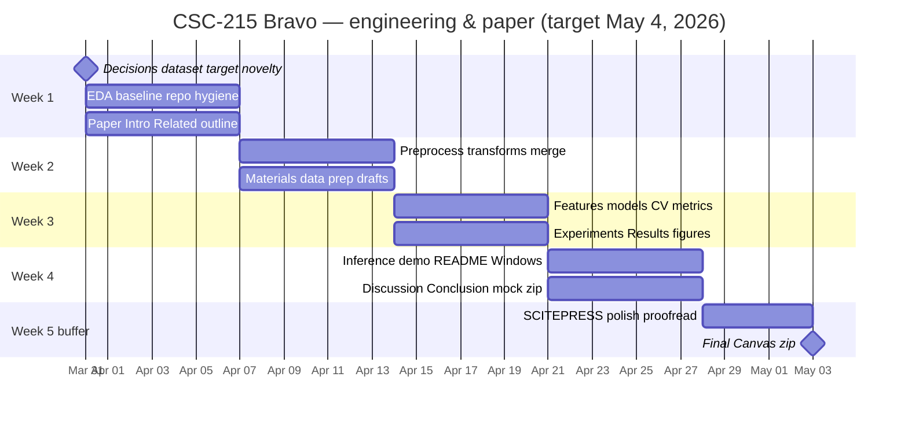
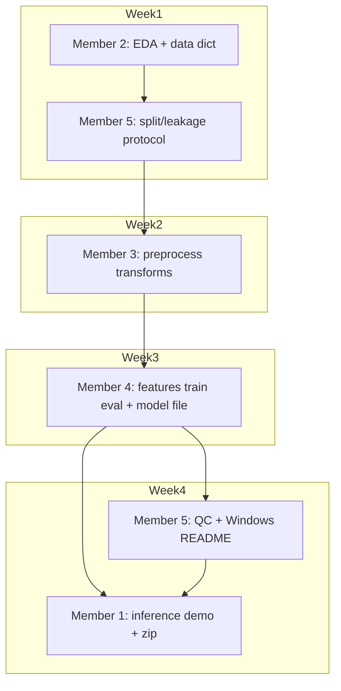

# CSC-215 Bravo — Project Master Plan

**Single source of truth** for timeline, weekly deliverables, member workload, diagrams, progress tracking, and how the PM runs the project.  
**Course deadline:** 11:59 PM, **Monday, May 4, 2026** (Canvas).  
**Team size:** 5 · **Repo:** [github.com/LamiyaR/csc215-bravo-salary-ml](https://github.com/LamiyaR/csc215-bravo-salary-ml)

---

## Table of contents

1. [Problem & official outcomes](#1-problem--official-outcomes)  
2. [Platforms (code + paper + progress)](#2-platforms-code-paper--progress)  
3. [How the PM runs this (rituals & gates)](#3-how-the-pm-runs-this-rituals--gates)  
4. [Work distribution by member (roles + notebooks)](#4-work-distribution-by-member-roles--notebooks)  
5. [Timeline diagram (Gantt)](#5-timeline-diagram-gantt)  
6. [Dependency diagram (who blocks whom)](#6-dependency-diagram-who-blocks-whom)  
7. [Weekly deliverables (detailed)](#7-weekly-deliverables-detailed)  
8. [Member × week matrix](#8-member--week-matrix)  
9. [Deliverables vs rubric map](#9-deliverables-vs-rubric-map)  
10. [External progress tracker setup](#10-external-progress-tracker-setup)  
11. [Submission checklist](#11-submission-checklist)  

---

## 1. Problem & official outcomes

### 1.1 Problem (one sentence)

Learn from historical job records that **include salary** to **predict salary** (or an agreed numeric target) for similar jobs from features such as role, experience, location, and company signals.

### 1.2 What we submit (Canvas)

| Item | Detail |
|------|--------|
| **Zip** | One `.zip` before deadline; folder name per syllabus: **`project {Group Name}`**. |
| **Code** | Notebooks/scripts, commented; inference path; data via README or script. |
| **README.txt** | Windows-friendly run instructions (preferred). |
| **Paper** | 6–8 pages, **SCITEPRESS** LaTeX: Intro, Lit review, Methods, Results, Discussion, Conclusion, References. |

### 1.3 Team decisions (lock in Meeting 1 — log in [`docs/DECISIONS.md`](./docs/DECISIONS.md))

- Exact **Kaggle** (or other) dataset name + license.  
- **Target column** (e.g. `salary_in_usd`).  
- **Novelty sentence** (one honest line for intro/presentation).  
- **Train/val/test** split rule + random seed.  

---

## 2. Platforms (code + paper + progress)

| Layer | Tool | Purpose |
|-------|------|---------|
| **Code & version control** | **GitHub** (this repo) | Source, PRs, history. |
| **Tasks linked to code** | **GitHub Issues** + **Milestones** (W1–W5) | Technical work, bugfixes, PR links. |
| **Human progress & status** | **Notion** *(recommended)* or **Trello** / **Google Sheets** | See [§10](#10-external-progress-tracker-setup) — **this is separate from GitHub** so non-coders see clarity at a glance. |
| **Paper** | **Overleaf** + SCITEPRESS | One PDF. |
| **Python** | `venv` + `requirements.txt` | Reproducibility. |
| **Notebooks** | Jupyter or Colab (team picks one default) | Syllabus-aligned. |
| **Meetings** | Zoom / Google Meet | Weekly + optional 15 min mid-week. |
| **Chat** | One channel only (Discord / Slack / WhatsApp) | Reduce missed messages. |

**PM rule:** GitHub proves *what merged*; Notion/Trello proves *who is blocked and what is due this week*.

---

## 3. How the PM runs this (rituals & gates)

### 3.1 Weekly meeting (45–60 min)

| Block | Time | Content |
|-------|------|---------|
| Decisions | 5 min | Only change scope if team agrees; update `docs/DECISIONS.md`. |
| Demo | 10 min | Screen share: notebook or script that ran on `main`. |
| Blockers | 10 min | Each blocker → one **helper** assigned. |
| Progress board | 10 min | Walk **Notion/Trello** columns; every task has **one owner**. |
| Paper | 10 min | New numbers/figures only; no unsupported claims. |
| Actions | 5 min | Each action: owner + due day. |

### 3.2 Friday “same page” drill (10 min)

Each member states **without notes**: dataset name, target variable, novelty sentence, their **next-week** top task.

### 3.3 Hard gates

| Gate | When | Rule |
|------|------|------|
| **G1 — Data lock** | End Week 1 | No dataset swaps without team log entry. |
| **G2 — Model freeze** | End Week 3 | No new model families; only fixes. |
| **G3 — Code freeze** | End Week 4 | Only README/integration/typos. |
| **G4 — Paper freeze** | 3 days before due | Typos/format only. |
| **G5 — Dry run** | 48–72 h before due | Clone fresh → README only → run pipeline. |

### 3.4 If I were PM (personal playbook)

- I would **never** let a week end with **zero merge to `main`.**  
- I would **pair** brittle handoffs: M4 → M1 (model artifact), M3+M5 (README).  
- I would **reject** paper paragraphs that cite metrics without a **file name + location** in repo.  
- I would **timebox** hyperparameter tuning (e.g. one evening) so the paper gets written.  
- Full methodology reference: [`PM_PROJECT_PLAYBOOK.md`](./PM_PROJECT_PLAYBOOK.md) (SRS-style reqs, risks).  

---

## 4. Work distribution by member (roles + notebooks)

| Member | Role | Primary notebook / artifact | Primary paper sections |
|--------|------|----------------------------|-------------------------|
| **M1** | Lead / PM | `notebooks/04_inference_demo.ipynb` (or `scripts/predict.py`); final zip | Abstract, Intro, Conclusion, Ack; final LaTeX compile |
| **M2** | Analyst | `notebooks/01_eda.ipynb`; data dictionary | Related Work, References, Materials (dataset) |
| **M3** | Programmer | `notebooks/02_preprocess.ipynb`; `requirements.txt`; README draft | Materials (preprocess & transforms) |
| **M4** | ML lead | `notebooks/03_train_eval.ipynb`; saved model; `figures/`; `results.csv` | Materials (models/training), Experiments & Results |
| **M5** | QC | `notebooks/05_qc_checks.ipynb`; Windows README proof | Discussion |

**Shared admin:** M1 runs meetings; **M2 co-scribes** minutes in `docs/meetings/` (see template in [`docs/WEEKLY_STATUS_TEMPLATE.md`](./docs/WEEKLY_STATUS_TEMPLATE.md)).

---

## 5. Timeline diagram (Gantt)

*Calendar aligns to a **5-week** arc ending just before **May 4, 2026**; adjust labels if your kickoff date differs.*

### 5.1 Milestone table (same timeline, tabular)

| Week | Dates (example) | Engineering milestone | Paper milestone |
|------|-----------------|------------------------|-----------------|
| **1** | Mar 31 – Apr 6 | EDA + baseline run on `main` | Intro draft + Related outline |
| **2** | Apr 7 – Apr 13 | Preprocess/transforms merged | Materials (data + prep) drafted |
| **3** | Apr 14 – Apr 20 | Main models + CV + figures | Experiments & Results filled |
| **4** | Apr 21 – Apr 27 | Inference demo + QC + README pass | Discussion + Conclusion |
| **5** | Apr 28 – May 3 | Dry-run zip only | Format + page limit + proofread |

---

## 6. Dependency diagram (who blocks whom)

---

## 7. Weekly deliverables (detailed)

### Week 1 — Charter & foundation

| ID | Deliverable | Owner | Done when |
|----|-------------|-------|-----------|
| W1-01 | Meeting schedule + recurring link | M1 | Calendar invites sent |
| W1-02 | `docs/DECISIONS.md` filled: dataset, target, novelty, seed | All | Signed in meeting |
| W1-03 | Overleaf project + SCITEPRESS template | M1 | Link in DECISIONS |
| W1-04 | GitHub Milestones **W1–W5** created | M1 | Visible in repo |
| W1-05 | External tracker (Notion/Trello) board live | M1 | Link in DECISIONS |
| W1-06 | `notebooks/01_eda.ipynb` on `main` | M2 | Merged PR |
| W1-07 | Data dictionary (1–2 pages or markdown) | M2 | In `/docs` |
| W1-08 | `docs/EVAL_PROTOCOL.md` — split ratios, leakage rules | M5 | Merged |
| W1-09 | `requirements.txt` v0 + repo folders | M3 | Merged |
| W1-10 | Baseline model notebook stub OR section in `03` (team choice) | M4 | One metric on hold-out |
| W1-11 | Related Work: **≥6** sources in `.bib` | M2 | Overleaf |
| W1-12 | Introduction v1 | M1 | Overleaf |
| W1-13 | Meeting notes | M2 | `docs/meetings/YYYY-MM-DD.md` |

### Week 2 — Preprocess & Methods (data path)

| ID | Deliverable | Owner | Done when |
|----|-------------|-------|-----------|
| W2-01 | `notebooks/02_preprocess.ipynb` merged | M3 | Fits encoders on **train only** |
| W2-02 | README draft: install + run preprocess | M3 | PR merged |
| W2-03 | Materials subsection: dataset (M2) + prep (M3) | M2, M3 | Overleaf |
| W2-04 | Feature engineering **plan** agreed (columns, text or not) | M4, M5 | Logged in DECISIONS |
| W2-05 | Progress board 100% Week-2 tasks reviewed | M1 | Friday meeting |

### Week 3 — Models, metrics, Results

| ID | Deliverable | Owner | Done when |
|----|-------------|-------|-----------|
| W3-01 | `03_train_eval`: baseline + XGBoost or LightGBM | M4 | Merged |
| W3-02 | Saved model artifact path documented | M4 | README or DECISIONS |
| W3-03 | `figures/` + `results.csv` on `main` | M4 | Merged |
| W3-04 | Test metrics: MAE, RMSE, R² on **held-out** test | M4, M5 | Matches paper |
| W3-05 | `05_qc_checks.ipynb`: reproduce metrics | M5 | Within tolerance |
| W3-06 | Experiments & Results draft complete | M4 | No TBD numbers |
| W3-07 | **G2** model freeze declared | M1 | Meeting note |

### Week 4 — Inference, QC, Discussion, mock submission

| ID | Deliverable | Owner | Done when |
|----|-------------|-------|-----------|
| W4-01 | `04_inference_demo.ipynb` loads model + predicts sample | M1 | Merged |
| W4-02 | README: full train + predict path | M3, M5 | M5 Windows OK |
| W4-03 | Discussion draft | M5 | Overleaf |
| W4-04 | Conclusion draft | M1 | Overleaf |
| W4-05 | **Mock zip** `project {Group Name}` structure | M1 | Team opens zip checklist |
| W4-06 | **G5** dry run from clean clone | M1 | Pass or issues filed |

### Week 5 — Buffer & submit

| ID | Deliverable | Owner | Done when |
|----|-------------|-------|-----------|
| W5-01 | SCITEPRESS PDF 6–8 pages | M1 | Page count |
| W5-02 | Final proofread (grammar) | All | Rotating pairs |
| W5-03 | Final zip + Canvas upload | M1 | Before deadline |
| W5-04 | Presentation outline | M1 | Slides stub |

---

## 8. Member × week matrix

**Legend:** ● = primary focus · ◐ = support / review · ○ = light touch

| Member | Week 1 | Week 2 | Week 3 | Week 4 | Week 5 |
|--------|--------|--------|--------|--------|--------|
| **M1** | ● PM, Overleaf, Intro, decisions log | ◐ Methods sync, agenda | ◐ Results alignment | ● Inference, mock zip, dry run | ● Final PDF, submit, present prep |
| **M2** | ● EDA, data dict, Related Work, `.bib` | ● Materials dataset, lit polish | ◐ Results tables/captions help | ◐ Proofread | ◐ Proofread |
| **M3** | ● `requirements`, repo layout, preprocess **start** | ● Preprocess/transforms merge, README draft | ◐ Support M4 integration | ● README finalize with M5 | ◐ Submit support |
| **M4** | ● Baseline / stub | ◐ Features plan | ● Train, CV, figures, Results | ◐ Handoff to M1 demo | ◐ Presentation metrics slide |
| **M5** | ● Eval protocol, leakage review | ● Review preprocess PR | ● QC notebook, metric audit | ● Discussion, Windows README | ◐ Final checklist |

---

## 9. Deliverables vs rubric map

| Rubric area (typical) | Evidence in repo | Primary owners |
|----------------------|------------------|----------------|
| Preprocessing | `02_preprocess` + Methods text | M3, M2 |
| Feature engineering | `03_train_eval` + text | M4 |
| Transformation | `02_preprocess` | M3 |
| Algorithm choice | `03_train_eval` | M4 |
| Metrics / evaluation | `results.csv`, `05_qc`, Discussion | M4, M5 |
| Research article | Overleaf PDF | All; M1 compile |
| Team cohesion | Meetings, tracker, PRs | M1, M2 notes |

---

## 10. External progress tracker setup

**Why not GitHub alone?** Issues are great for code but **bad at “at a glance”** status for five busy students. A **second tool** is standard PM practice.

### Option A — **Notion** (recommended)

1. Create a free **Teamspace** → page **“Bravo — Spring 2026”.**  
2. Add a **database** (table) named **Tasks** with properties:

| Property | Type | Values / notes |
|----------|------|----------------|
| **Task** | Title | Short verb phrase |
| **Week** | Select | W1 … W5 |
| **Owner** | Person | M1–M5 (tag people) |
| **Status** | Select | Todo / Doing / Blocked / Done |
| **Due** | Date | Friday of that week |
| **GitHub** | URL | Link to Issue or PR |
| **Blocked by** | Text | e.g. “waiting on preprocess merge” |

3. Create **views:**  
   - *By Week* (group by Week)  
   - *By Member* (group by Owner)  
   - *Kanban* (group by Status)  

4. **Rule:** Every **Week deliverable** in §7 exists as **one Notion row** minimum.

### Option B — **Trello**

- Lists: **Backlog | W1 | W2 | W3 | W4 | W5 | Done**  
- Each card: Owner (M1–M5), checklist, due date, link to GitHub Issue.

### Option C — **Google Sheets**

- Columns: `Task | Owner | Week | Status | Last update | Link`  
- One tab per week **or** filter views. Lowest friction; weakest for mobile.

**PM cadence:** Update tracker **before** the weekly meeting; screenshot or export optional archive in `docs/meetings/`.

---

## 11. Submission checklist

- [ ] Folder name matches syllabus **`project {Group Name}`** inside zip  
- [ ] `README.txt` tested on **Windows** (Member 5 sign-off)  
- [ ] No disallowed commercial URLs in README/PDF  
- [ ] Paper page count 6–8, SCITEPRESS  
- [ ] Every metric in paper traceable to `results.csv` / notebook  
- [ ] `main` branch runs end-to-end per README  
- [ ] All five names / roles clear for presentation  

---

## Related documents

| File | Use |
|------|-----|
| [`PM_PROJECT_PLAYBOOK.md`](./PM_PROJECT_PLAYBOOK.md) | SRS-style requirements, risks, PM checklist |
| [`DETAILED_WORK_DISTRIBUTION.md`](./DETAILED_WORK_DISTRIBUTION.md) | Deep dependency / handoff detail |
| [`LEADER_KICKOFF_EASY_PLAN.md`](./LEADER_KICKOFF_EASY_PLAN.md) | Meeting 1 decisions table |
| [`docs/EXTERNAL_PROGRESS_TRACKING.md`](./docs/EXTERNAL_PROGRESS_TRACKING.md) | Copy-paste Notion/Trello templates |
| [`docs/WEEKLY_STATUS_TEMPLATE.md`](./docs/WEEKLY_STATUS_TEMPLATE.md) | Friday status blurb |
| [`docs/DECISIONS.md`](./docs/DECISIONS.md) | Living decision log |

---

*Maintained by project lead. Changes require team agreement per `docs/DECISIONS.md`.*
